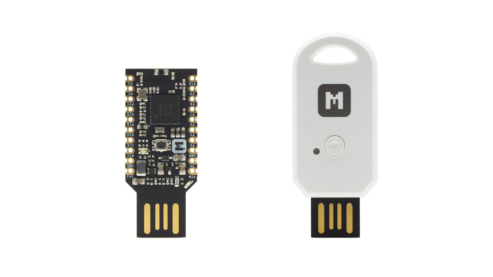

# OpenSK  <small>An open-source implementation for security keys written in Rust that supports both FIDO U2F and FIDO2 standards.</small>

## Introduction

[OpenSK](https://github.com/google/OpenSK) released by Google is a fully open-source implementation for security keys written in [Rust](https://www.rust-lang.org/) that supports both FIDO U2F and FIDO2 standards.

OpenSK is based on the FIDO2 specifications, which combine the World Wide Web Consortium’s (W3C) [Web Authentication (WebAuthn) specification](https://fidoalliance.org/fido2/fido2-web-authentication-webauthn/) and FIDO Alliance’s corresponding [Client-to-Authenticator Protocol (CTAP)](https://fidoalliance.org/specifications/download/).

The nRF52840 MDK USB Dongle works well with OpenSK. Taking advantage of the UF2 Bootloader, you can easily program the OpenSK by just copying the `.uf2`-format image to the flash drive.

If you're interested in contributing to the ongoing development of OpenSK, then the [OpenSK GitHub repository](https://github.com/makerdiary/opensk) is for you.

<a href="https://github.com/makerdiary/opensk"><button data-md-color-primary="red-bud"><i class="fa fa-github"></i> OpenSK</button></a>

## Explore Further

Now that you are familiar with the OpenSK, it's time to explore more tutorials available below:

* [Getting Started with OpenSK](getting-started.md)
* [How to build OpenSK](building.md)

## License
Content on this page is licensed under the [Creative Commons Attribution 3.0 License](https://creativecommons.org/licenses/by/3.0/).

## Create an Issue

Interested in contributing to this project? Want to report a bug? Feel free to click here:

<a href="https://github.com/makerdiary/nrf52840-mdk-usb-dongle/issues/new"><button data-md-color-primary="red-bud"><i class="fa fa-github"></i> Create an Issue</button></a>

