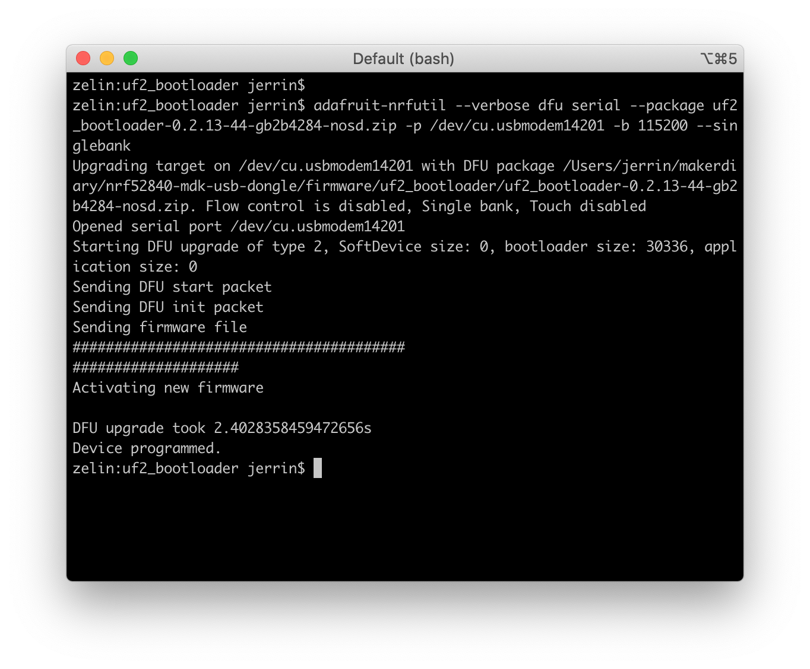

# Programming the nRF52840 MDK USB Dongle

The nRF52840 MDK USB Dongle supports the following Device Firmware Update (DFU) options:

* [DFU via Open Bootloader](#dfu-via-open-bootloader)
* [DFU via UF2 Bootloader](#dfu-via-uf2-bootloader)

## DFU via Open Bootloader

The nRF52840 MDK USB Dongle was previously shipped with [Open Bootloader](https://github.com/makerdiary/nrf52840-mdk-usb-dongle/tree/master/firmware/open_bootloader) with Device Firmware Update (DFU) functionality. The source code and the project file are located in: [nrf52840-mdk-usb-dongle/examples/open_bootloader](https://github.com/makerdiary/nrf52840-mdk-usb-dongle/tree/master/examples/nrf5-sdk/open_bootloader).

You can easily program the Dongle using the following tools:

* [nRF Connect for Desktop](https://www.nordicsemi.com/Software-and-tools/Development-Tools/nRF-Connect-for-desktop)
* [nrfutil](https://github.com/NordicSemiconductor/pc-nrfutil/) from the command line.

### Using nRF Connect for Desktop

nRF Connect for Desktop contains a programmer app called [*nRF Connect Programmer*](https://github.com/NordicSemiconductor/pc-nrfconnect-programmer). It is a cross-platform tool that enables programming firmwares to device. Memory layout for Nordic USB devices can be displayed. Content for the HEX files can be displayed, too. Moreover, content of HEX files can be written to the devices.


See the [GitHub](https://github.com/NordicSemiconductor/pc-nrfconnect-programmer#installation) pages for information on how to install the programmer.

To program the Dongle, it must be in DFU mode.

While holding the dongle's RESET/USR button, connect it to your computer. When the Dongle has entered the DFU mode, the RGB LED pulses RED. The Dongle is now ready for programming.

Launch *Programmer* app from nRF Connect, you can find the dongle and select it to start programming.


### Using nRF Util

[nRF Util](https://github.com/NordicSemiconductor/pc-nrfutil) is a Python package and command-line utility that supports Device Firmware Updates (DFU) and cryptographic functionality.


See the [GitHub](https://github.com/NordicSemiconductor/pc-nrfutil#documentation) pages for information on how to install and use nRF Util.

To install the latest published version from the Python Package Index simply type:

``` sh
pip install nrfutil
```

Here is an example of the generation of a package from an application's `app.hex` file:

``` sh
nrfutil pkg generate --hw-version 52 --sd-req 0x00 --application-version 1 --application app.hex  app_dfu_package.zip
```

!!! tip
    There is no SoftDevice required here, just set `--sd-req` to `0x00`. 

    Run `nrfutil pkg generate --help` for more details.

Enter DFU mode by holding the dongle's RESET/USR button and connecting to your PC. Use the following command to update firmware:

``` sh
nrfutil dfu usb-serial -pkg app_dfu_package.zip -p <your-serial-port-name>
```

## DFU via UF2 Bootloader

UF2 Bootloader is an easy-to-use bootloader that appears as a flash drive. You can just copy `.uf2`-format application images to the flash drive to load new firmware. The prebuilt UF2 Bootloader firmware is located in [uf2_bootloader](https://github.com/makerdiary/nrf52840-mdk-usb-dongle/tree/master/firmware/uf2_bootloader).

To create your own UF2 DFU update image, simply use the [Python conversion script](https://github.com/makerdiary/nrf52840-mdk-usb-dongle/tree/master/tools) on a `.bin` file or `.hex` file, specifying the family as `0xADA52840`.

!!! tip
	If using a `.bin` file with the conversion script you must specify application address with the `-b` switch, this address depend on the SoftDevice size/version e.g S140 v6 is `0x26000`.

To create a UF2 image from a `.bin` file:
``` sh
uf2conv.py firmware.bin -c -b 0x26000 -f 0xADA52840
```

To create a UF2 image from a `.hex` file:
``` sh
uf2conv.py firmware.hex -c -f 0xADA52840
```

Enter DFU mode by holding the dongle's RESET/USR button and connecting to your PC. A flash drive with the name **MDK-DONGLE** will appear.

Just copy the `.uf2`-format image to the flash drive to load new firmware. 

## Upgrade to UF2 Bootloader from Open Bootloader

The nRF52840 MDK USB Dongle was previously shipped with [Open Bootloader](https://github.com/makerdiary/nrf52840-mdk-usb-dongle/tree/master/firmware/open_bootloader). You can upgrade to UF2 Bootloader to take advantage of the latest features.

!!! note
	As Open Bootloader update must come from signed packages, the new UF2 Bootloader must be signed.
	The signed package is located in: [firmware/open_bootloader/uf2_bootloader-0.2.13-44-gb2b4284-nosd_signed.zip](https://github.com/makerdiary/nrf52840-mdk-usb-dongle/tree/master/firmware/open_bootloader)

Enter DFU mode by holding the dongle's RESET/USR button and connecting to your PC. Use the following command to update firmware:

``` sh
nrfutil dfu usb-serial -pkg uf2_bootloader-0.2.13-44-gb2b4284-nosd_signed.zip -p <your-serial-port-name>
```


## Update UF2 Bootloader

The UF2 Bootloader is self-upgradable. An update ensures you have the most recent features and improvements for your current version of UF2 Bootloader. 

!!! tip
	The latest prebuilt UF2 Bootloader is located in: [firmware/uf2_bootloader](https://github.com/makerdiary/nrf52840-mdk-usb-dongle/tree/master/firmware/uf2_bootloader)

To update UF2 Bootloader, [adafruit-nrfutil](https://github.com/adafruit/Adafruit_nRF52_nrfutil) is needed. Run the following command to install `adafruit-nrfutil` from PyPi:

``` sh
pip3 install --user adafruit-nrfutil
```

Here is an example of the generation of a package from a `.hex` bootloader file:

``` sh
adafruit-nrfutil dfu genpkg --dev-type 0x0052 --dev-revision 52840 --bootloader uf2_bootloader-0.2.13-44-gb2b4284-nosd.hex uf2_bootloader-0.2.13-44-gb2b4284-nosd.zip
```

Enter DFU mode by holding the dongle's RESET/USR button and connecting to your PC. Use the following command to update UF2 Bootloader:

``` sh
adafruit-nrfutil --verbose dfu serial --package uf2_bootloader-0.2.13-44-gb2b4284-nosd.zip -p <your-serial-port-name> -b 115200 --singlebank
```



## License
Content on this page is licensed under the [Creative Commons Attribution 3.0 License](https://creativecommons.org/licenses/by/3.0/).

## Create an Issue

Interested in contributing to this project? Want to report a bug? Feel free to click here:

<a href="https://github.com/makerdiary/nrf52840-mdk-usb-dongle/issues/new"><button data-md-color-primary="red-bud"><i class="fa fa-github"></i> Create an Issue</button></a>

